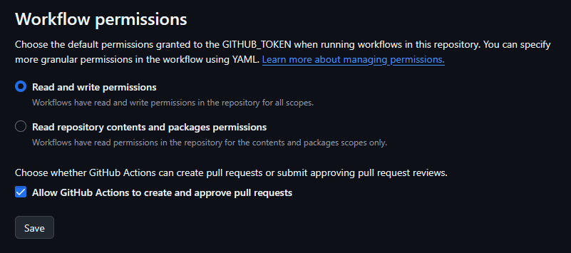

# changelog-test
Testing out generating a changelog

Important note for when using github workflows (generates Changelog.md based on a release being created)
Make sure to toggle these settings as the workflow won't have enough permissions:
